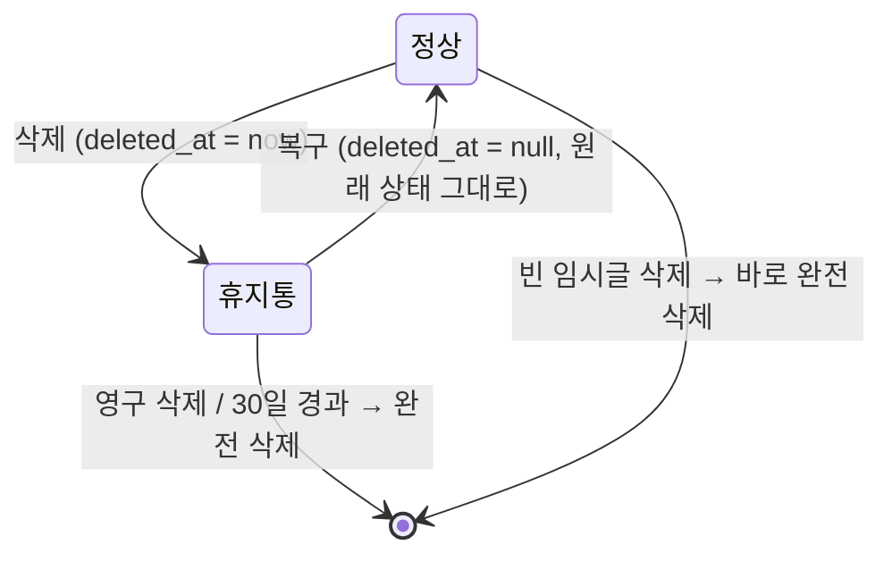

# 글 삭제·회원 탈퇴 데이터 처리 설계

> 작성일 2026-10-02 · 관련 요구사항: C-POST-5(글 삭제). 연관: 회원 탈퇴(Tier C), [06 공개 범위](./06-visibility.md), [08 블로그 주소](./08-blog-address.md) §6, [09 닉네임](./09-nickname.md) N-11
> 결정: 글은 **휴지통 30일 → 자동 완전 삭제.** 탈퇴는 **30일 유예 → 익명 처리.** 탈퇴 화면·기능 구현은 Tier C지만 데이터 정책은 여기서 확정한다.
> 2026-10-07 수정: 회의 결정(신고 분리 E1·스냅샷 보관 H5, 동의·정지 이력 분리 E2·E3·E6, 세션 쿠키 H7, `friendship` 공통 V1 M1, 회원 프로필 컬럼 삭제, 탈퇴 회원 사진, 최근 활동 표시)을 반영했다. 30일 뒤 처리의 단계 구현은 [44 탈퇴 화면](./44-withdraw.md) §4, 신고 규칙은 [43 신고](./43-report-hide.md) §5.

---

## 1. 결정 사항

| # | 안건 | 결정 | 이유 |
|---|---|---|---|
| D-1 | 글 삭제 방식 | **휴지통 30일 → 자동 완전 삭제** | 실수로 지운 글을 되살릴 수 있고, 30일 뒤에는 실제로 지워서 데이터가 쌓이지 않는다 |
| D-2 | 빈 임시글 | 휴지통을 거치지 않고 **바로 완전 삭제** | 제목·본문이 모두 비었으면 보관할 이유가 없다 |
| D-3 | 휴지통에 있는 동안 | 댓글·좋아요·태그·사진 연결은 그대로, 수정·발행·자동 저장은 404 | 복구하면 그대로 돌아와야 한다 |
| D-4 | 복구 | **원래 상태·원래 목록 위치로** (상태·공개 범위·`first_public_at` 그대로) | 복구한 글이 목록 맨 위로 튀어 오르지 않는다 |
| D-5 | 완전 삭제 시 남이 쓴 댓글 | 함께 삭제 (`ON DELETE CASCADE`) | 글이 없으면 댓글이 보일 곳이 없다 (나민서 D-16) |
| D-6 | 탈퇴 유예 | **30일.** 그동안 다시 로그인하면 복구 | 강성찬 BASE-05, 김민서 P-7 |
| D-7 | 탈퇴 후 내 댓글 | **답글이 달린 댓글**은 내용을 지우고 "탈퇴한 사용자의 댓글이에요"로 남김, **답글이 없는 댓글**은 삭제 | 대화 흐름(답글)은 지키고 내 글은 남기지 않는다 |
| D-8 | 탈퇴 후 닉네임 | **30일 뒤 해제** (유예 중에는 묶어 둠) | 09 N-11 확정 |
| D-9 | 탈퇴 후 블로그 주소 | **영구 보존, 재사용 불가** | 옛 링크로 다른 사람의 블로그가 열리는 사칭 방지 (08 §6) |
| D-10 | 회원 행 | **익명 껍데기**로 남김 (블로그 주소만, 개인 정보는 비움). 동의(`member_agreement`)·정지 이력(`member_suspension`)은 남김 (2026-10-07 회의 E3·E6) | 블로그 주소 예약, 남은 댓글·신고의 작성자, 동의 증빙·재가입 악용 확인 |
| D-11 | 같은 이메일 재가입 | 유예 중에는 복구 안내, 30일 뒤에는 새 계정 가능 | 로그인 수단(`auth_identity`)을 지우므로 이메일이 풀린다 |

---

## 2. 글 삭제

### 2-1. 상태



`deleted_at`은 `status`(임시·발행)·`visibility`와 별개다. 휴지통에 넣어도 상태와 공개 범위는 바뀌지 않아서 복구하면 그대로 돌아온다.

### 2-2. 화면

```
[삭제] → "휴지통으로 옮길까요? 30일 뒤 완전히 삭제돼요"  [휴지통으로] [취소]

내 글 관리  [임시글] [발행 글] [휴지통]
  JPA N+1 정리        삭제 10월 2일 · 27일 뒤 완전 삭제     [복구] [영구 삭제]
  
[영구 삭제] → "영구 삭제하면 되돌릴 수 없어요. 댓글·좋아요도 함께 지워져요"  [영구 삭제] [취소]
```

### 2-3. 규칙

| 항목 | 규칙 |
|---|---|
| 누가 | 작성자만. 남의 글은 404. 관리자는 삭제가 아니라 숨김 (Tier C) |
| 대상 | 임시글·발행 글 모두 휴지통으로. 제목·본문이 모두 빈 임시글은 바로 완전 삭제 (D-2) |
| 즉시 효과 | 상세 404, 홈·블로그·태그·검색·sitemap에서 사라짐, 그 글의 댓글·좋아요도 함께 안 보임, 블로그 글 수에서 빠짐 |
| 보존 | 행·댓글·좋아요·태그·`post_image`·`post_draft`·반응 수 모두 그대로 (D-3) |
| 자동 저장 | 휴지통으로 옮기기 직전에 Redis 자동 저장분을 DB에 반영하고(04 §2-4) 커밋 후 키 삭제. 휴지통 글의 자동 저장·수정·발행·공개 범위 변경 API는 404 |
| 복구 | `deleted_at = null`. 원래 상태·공개 범위·`first_public_at` 그대로라 목록의 원래 위치로 돌아간다 (D-4) |
| 영구 삭제 | 휴지통에 있을 때만. 즉시 완전 삭제 (§2-5) |
| 글 ID·주소 | 재사용하지 않는다 |
| 휴지통 목록 | 본인만, `deleted_at` 최신순, 커서 방식 20개씩 |

### 2-4. API

| 요청 | 동작 | 응답 |
|---|---|---|
| `DELETE /api/posts/{id}` | 휴지통으로 (빈 임시글은 완전 삭제). 이미 휴지통이면 그대로 | 200 `{ trashed: true, purgeAt }` 또는 `{ purged: true }` |
| `POST /api/posts/{id}/restore` | 복구 | 200 / 휴지통에 없으면 404 |
| `DELETE /api/posts/{id}/permanent` | 영구 삭제 | 200 / 휴지통에 없으면 404 |
| `GET /api/me/trash?cursor=…` | 휴지통 목록 | `{ items: [{ id, title, deletedAt, purgeAt }], nextCursor }` |

모든 요청은 `author_id = 현재 사용자` 조건으로 행 잠금(`FOR UPDATE`) 후 처리한다.

### 2-5. 완전 삭제

```sql
-- 0) 이 글과 이 글의 댓글에 걸린 대기 중 신고 사건을 "대상 없음"으로 종료 (2026-10-07 회의 E1·H5)
--    report_case.post_id·comment_id는 ON DELETE SET NULL이라 글을 지우기 전에 찾는다. 자동 종료는 처리 관리자 없음
UPDATE report_case SET status = 'CLOSED_NO_TARGET', handled_at = now(), handled_by = NULL
WHERE status = 'PENDING'
  AND (post_id = :id OR comment_id IN (SELECT id FROM comment WHERE post_id = :id));
-- 1) 이 글에서 쓰던 사진의 연결이 끊긴 것으로 기록 (사진 정리 배치가 7일 뒤 파일 삭제, 04 §4-4)
UPDATE image SET detached_at = now()
WHERE id IN (SELECT image_id FROM post_image WHERE post_id = :id) AND detached_at IS NULL
  AND id NOT IN (SELECT image_id FROM post_image WHERE post_id <> :id);   -- 다른 글에서도 쓰면 유지
-- 2) 글 삭제 → post_tag, comment(남이 쓴 댓글 포함), post_like, post_image, post_draft는 CASCADE
DELETE FROM post WHERE id = :id;
```

| 배치 | 규칙 |
|---|---|
| 휴지통 비우기 | 매일 새벽, `deleted_at < now() - 30일`인 글을 100개씩 완전 삭제. ShedLock으로 한 서버에서만 |
| 태그 | `tag` 행은 남긴다 (다른 글이 다시 쓸 수 있다) |
| 신고 기록 | `report_case`·`report` 행은 남는다. 글·댓글이 지워지면 `post_id`·`comment_id`만 FK `ON DELETE SET NULL`로 비워지고, 대상 작성자(`target_author_id`)와 스냅샷으로 기록을 본다 |
| 신고 스냅샷 비우기 | 매일 새벽, ShedLock. 처리된 지(`handled_at`) 30일이 지난 사건의 `snapshot_title`·`snapshot_content`와 그 사건 `report.detail`을 NULL로 (행·상태·사유·처리 일자는 유지). 삭제와 무관하게 처리된 모든 사건에 적용 (2026-10-07 회의 H5). 탈퇴 회원 콘텐츠의 대기 사건은 30일 뒤 처리(§6-3)에서 닫히고 그때부터 30일이 지나야 비워지므로, 탈퇴 요청부터 **최대 약 60일** 남는다. 이 규칙을 그대로 쓴다 (2026-10-07 결정) |

### 2-6. 삭제한 글이 새지 않게

| # | 방법 |
|---|---|
| 1 | `Post` 엔티티에 Hibernate `@SQLRestriction("deleted_at IS NULL")`. 기본 조회는 자동으로 휴지통 글을 뺀다. 휴지통 조회·완전 삭제만 별도 쿼리 |
| 2 | 직접 쓴 쿼리(목록·검색)는 06 §7의 공용 조건(`VisibilityFilter`)만 쓰고, 그 조건에 `deleted_at IS NULL`이 들어 있다 |
| 3 | `PostAccessPolicy.canRead`는 삭제 여부를 가장 먼저 확인한다 |
| 4 | 06 §8 권한 매트릭스 테스트에 "휴지통 글" 상태를 추가한다 (작성자도 상세 404, 휴지통 목록에서만 보임) |

---

## 3. 회원 탈퇴 데이터 처리

### 3-1. 흐름

```
[회원 탈퇴] → 확인: 이메일 가입은 비밀번호, 소셜 가입은 "탈퇴" 직접 입력
 → 안내·동의: "30일 동안은 다시 로그인하면 복구할 수 있어요(복구를 위한 보관).
              30일 뒤에는 글·댓글·사진이 완전히 삭제되고 되돌릴 수 없어요."
 → 즉시 (유예 시작):  status = WITHDRAWN, withdrawn_at = now()
     · 모든 기기 로그아웃 (Spring Session의 Redis 세션 전부 삭제 → 세션 쿠키가 바로 무효, 2026-10-07 회의 H7)
     · 블로그 /@주소 404, 내 글 전부 404·목록에서 사라짐
     · 내가 쓴 댓글은 "탈퇴한 사용자의 댓글이에요"로 가려서 보임
 → 30일 안에 로그인 → "탈퇴 신청한 계정이에요. [복구하기]" → status = ACTIVE, withdrawn_at = null → 전부 원래대로
 → 30일 뒤 배치 → 완전 처리 (§3-3)
```

### 3-2. 유예 기간 중 규칙

| 항목 | 규칙 |
|---|---|
| 내 글 | 행은 그대로. 06 §7의 공용 조건이 **작성자가 탈퇴 신청 상태면 제외**한다 (`author.withdrawn_at IS NULL`) |
| 내 댓글 | 행은 그대로, 화면에서만 내용을 가린다 |
| 내가 누른 좋아요 | 그대로 (반응 수 유지) |
| 닉네임·블로그 주소 | 묶어 둔다 (다른 사람이 쓸 수 없다) |
| 로그인 | 가능하지만 복구 화면만 보인다 (복구하기 / 로그아웃) |
| 비밀번호 재설정 | 가능 (복구하려는 사람을 위해) |
| 같은 이메일로 가입 시도 | "탈퇴 신청한 계정이 있어요. 로그인하면 복구할 수 있어요" |
| 정지 | 유예 중 회원은 `status = 'WITHDRAWN'`이라 `SUSPENDED`로 바꿀 수 없다 (`ck_member_withdrawn`). 정지 중 탈퇴 요청 경로와 영구 정지 계정의 개인정보 보유 기간은 **미정** (검증 M11, 43 §6과 함께 정한다) |

### 3-3. 30일 뒤 완전 처리 (회원 1명 = 트랜잭션 1개)

각 단계는 모듈별 `WithdrawalPurgeStep`으로 구현하고 `order` 순서대로 실행한다 ([44 §4](./44-withdraw.md)). 기존 순서 번호(1~8)는 다른 문서가 참조하므로 바꾸지 않고, 뒤에 붙은 단계는 `6-1`처럼 적는다.

| 순서 | 44 order | 데이터 | 처리 |
|---|---|---|---|
| 1 | 10 | 내 글 (휴지통 포함) | §2-5와 같이 완전 삭제(0단계 신고 종료 포함) → 남이 내 글에 쓴 댓글·좋아요도 함께 삭제 |
| 2 | 20 | 남의 글에 쓴 내 댓글 | **답글이 달린 댓글**: `content = ''`, `deleted_at = now()` → "탈퇴한 사용자의 댓글이에요". **답글이 없는 댓글**: 삭제. 해당 글의 `comment_count` 감소 (D-7) |
| 3 | 30 | 내가 누른 좋아요 | 해당 글의 `like_count` 감소 후 삭제 |
| 4 | 40 | 올린 사진 (프로필 사진 포함) | 내가 올린 사진 전부(지금 프로필 사진 = `purpose = 'PROFILE'`·`status = 'ATTACHED'` 행 포함)를 떼어 `detached_at = now() - interval '7 days'`로 기록 → 익명 처리 뒤 **다음 사진 정리 배치**(04 §4-4)가 파일·행 삭제. 사진은 탈퇴 신청 뒤 30일 + 배치 한 번보다 오래 남지 않는다 (2026-10-07 회의 "탈퇴 회원 사진"·"회원 프로필 컬럼") |
| 5 | 50 | 로그인 수단 | `auth_identity` 삭제 → 같은 이메일로 새 가입 가능 (D-11) |
| 6 | 60 | 친구 관계 | `friendship` 행 삭제 (요청 중·수락 모두, 내가 A든 B든). 친구 맺기는 공통이라 항상 실행 (2026-10-07 회의 M1) |
| 6-1 | 65 | 팔로우 관계 | `follow` 양방향 삭제 (24 §6) |
| 6-2 | 70 | 알림 | 받은 알림 삭제, 묶음 알림에서 나를 빼고 다시 계산 (25 §8). 글·댓글 단계 다음 |
| 6-3 | 80 | 신고 | 내 콘텐츠의 대기 사건(`target_author_id = 나`, `status = 'PENDING'`) → `CLOSED_NO_TARGET`, `handled_at = now()`, `handled_by = NULL`. 내가 쓴 신고(`report.reporter_id = 나`) → `detail = NULL` (행·사유는 유지). 스냅샷은 §2-5 배치가 처리 30일 뒤 비운다 (2026-10-07 회의 E1·H5, 43 §5) |
| 7 | 90 | 회원 행 익명화 | `nickname`·`bio`·`nickname_changed_at`·`last_active_at` = null, `deleted_at = now()`. **`handle`은 그대로** (D-9, D-10). `member_agreement`(동의)·`member_suspension`(정지 이력)은 지우지 않는다 (2026-10-07 회의 E3·E6) |
| 8 | 커밋 후 | Redis | 세션·토큰·실패 횟수 키 삭제 |

```sql
-- 4) 내가 올린 사진 전부: 다음 정리 배치(연결 끊긴 지 7일 조건)가 바로 지우도록 기록. 1)에서 방금 뗀 사진도 포함
UPDATE image SET detached_at = now() - interval '7 days'
WHERE uploader_id = :me AND (detached_at IS NULL OR detached_at > now() - interval '7 days');
-- 6-3) 신고
UPDATE report_case SET status = 'CLOSED_NO_TARGET', handled_at = now(), handled_by = NULL
WHERE target_author_id = :me AND status = 'PENDING';
UPDATE report SET detail = NULL WHERE reporter_id = :me;   -- reason = 'OTHER'여도 ck_report_detail은 NULL을 통과시킨다
-- 7) 회원 행 익명화
UPDATE member SET nickname = NULL, bio = NULL, nickname_changed_at = NULL, last_active_at = NULL,
                  deleted_at = now(), updated_at = now()
WHERE id = :me;
```

| 배치 | 규칙 |
|---|---|
| 대상 | `status = 'WITHDRAWN' AND deleted_at IS NULL AND withdrawn_at < now() - 30일` |
| 실행 | 매일 새벽, ShedLock. 회원 1명씩 트랜잭션 (실패하면 그 회원만 다음 날 재시도) |

### 3-4. 익명 처리 후 표시

| 위치 | 표시 |
|---|---|
| 남아 있는 댓글 | 작성자 "탈퇴한 사용자", 내용 "탈퇴한 사용자의 댓글이에요", 프로필은 기본 회색 아이콘 |
| `/@옛주소` | 404 (주소는 예약되어 있어 아무도 쓸 수 없다) |
| 같은 이메일로 다시 가입 | 새 계정. 옛 주소는 예약 중이라 `kim755030_2`처럼 다른 주소가 된다 |

---

## 4. 스키마

[03-erd.md](./03-erd.md)에 반영했다.

```sql
-- member
nickname     varchar(10),            -- 익명 처리된 탈퇴 회원만 비울 수 있다
withdrawn_at timestamptz,            -- 탈퇴 신청 시각 (유예 계산)
CONSTRAINT ck_member_withdrawn     CHECK ((status = 'WITHDRAWN') = (withdrawn_at IS NOT NULL)),
CONSTRAINT ck_member_deleted       CHECK (deleted_at IS NULL OR status = 'WITHDRAWN'),
CONSTRAINT ck_member_nickname_null CHECK (nickname IS NOT NULL OR deleted_at IS NOT NULL),
CREATE INDEX ix_member_withdraw_purge ON member (withdrawn_at) WHERE status = 'WITHDRAWN' AND deleted_at IS NULL;

-- post: 휴지통 목록·비우기
CREATE INDEX ix_post_trash ON post (author_id, deleted_at DESC) WHERE deleted_at IS NOT NULL;

-- comment: 삭제된 댓글(답글이 있어 남긴 것)은 내용을 비운다
CONSTRAINT ck_comment_content CHECK (deleted_at IS NOT NULL OR length(btrim(content)) > 0)
```

- 닉네임 중복 방지 인덱스(`lower(nickname)` UNIQUE)는 빈 값(NULL)을 무시하므로, 익명 처리로 비운 닉네임은 바로 다른 사람이 쓸 수 있다 (D-8).
- `member`에는 사진·동의·정지 컬럼이 없다. 익명 껍데기 회원의 `created_at`, `member_agreement`(종류·버전·동의 일자), `member_suspension`(정지 이력)은 개인을 알아볼 수 있는 정보가 아니고 동의 증빙·재가입 악용 확인에 쓰므로 그대로 둔다 (2026-10-07 회의 E2·E3·E6).
- 신고 스냅샷 비우기 배치(§2-5)는 `report_case.handled_at`으로 찾는다. V1에는 이 조건 전용 인덱스가 없다 (필요하면 다음 마이그레이션에서 추가).

---

## 5. 공통 완료 기준

**C-POST-5 (글 삭제)**

| # | 기준 |
|---|---|
| 1 | 삭제한 글은 모든 목록·상세·검색·sitemap에서 즉시 사라지고(작성자에게도 상세 404), 휴지통에서만 보인다 |
| 2 | 복구하면 상태·공개 범위·목록 위치·댓글·좋아요가 삭제 전과 같다 |
| 3 | 30일이 지나거나 영구 삭제하면 글과 댓글·좋아요·태그 연결이 DB에서 지워지고, 사진은 정리 배치 대상이 되며, 그 글·댓글의 대기 중 신고 사건은 `CLOSED_NO_TARGET`(`handled_at` 기록, `handled_by` 없음)이 된다 |
| 4 | 빈 임시글은 휴지통을 거치지 않고 지워진다 |
| 5 | 남의 글은 삭제·복구·영구 삭제할 수 없다 (404) |

**회원 탈퇴 데이터 (Tier C 구현 시)**

| # | 기준 |
|---|---|
| 1 | 탈퇴 신청 즉시 모든 기기에서 로그아웃되고, 블로그와 글이 보이지 않는다 |
| 2 | 30일 안에 로그인해 복구하면 모든 것이 원래대로다 |
| 3 | 30일 뒤에는 이메일·닉네임·소개·최근 활동 일자가 남지 않고, 사진은 다음 정리 배치 뒤 남지 않으며, 블로그 주소는 다른 사람이 쓸 수 없다 |
| 4 | 답글이 달린 댓글만 "탈퇴한 사용자의 댓글이에요"로 남고, 반응 수가 실제 행 수와 맞는다 |
| 5 | 같은 이메일로 다시 가입하면 새 계정이 만들어진다 |
| 6 | 30일 뒤 처리 후 내 콘텐츠의 대기 신고는 `CLOSED_NO_TARGET`이고, 내가 쓴 신고의 설명은 비어 있으며, 동의·정지 이력 행은 남아 있다 |
