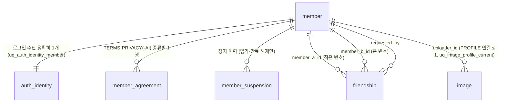
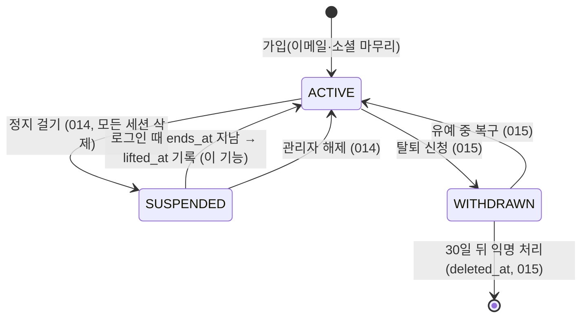
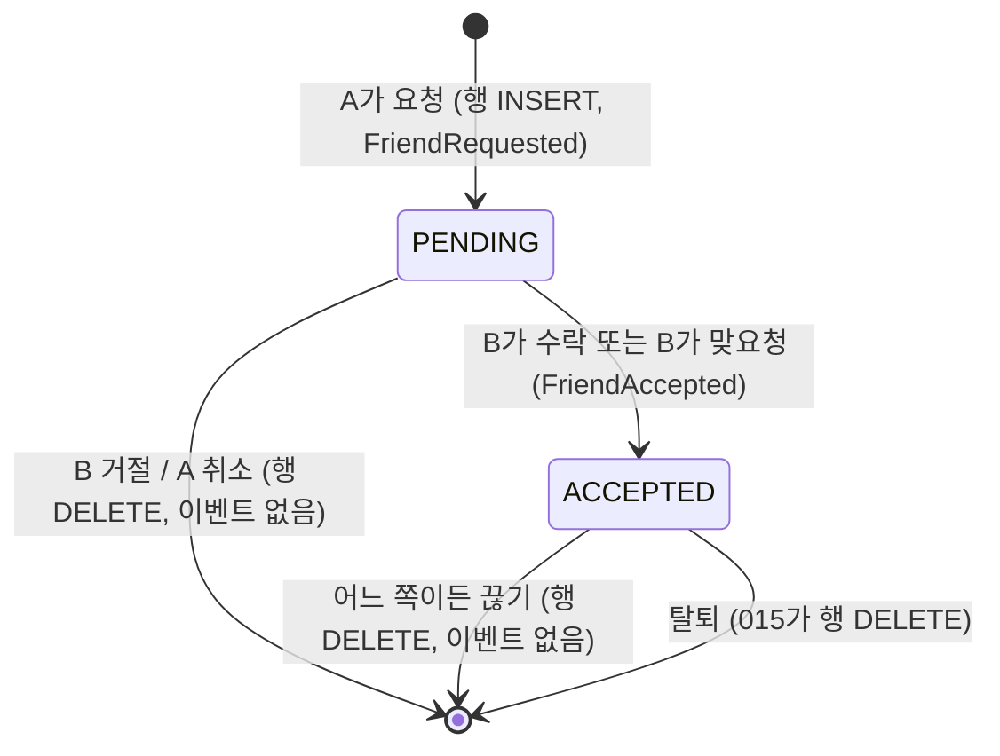

# Data Model: 계정·인증

**Feature**: `001-account-auth` | **Date**: 2026-10-07 | **Plan**: [plan.md](./plan.md)

**기준**: [docs/51-erd-unified.md](../../docs/51-erd-unified.md) (통합 ERD, 2026-10-07 최신). 51이 가리키는 `erd/V1__common_schema.sql`·`erd/erdcloud-export.sql`은 **이 저장소에 없다**(README "알려진 누락"). 그래서 51 §2 컬럼표·§3 제약표·"ERD 변경 제안" SQL 블록을 기준으로 삼는다. [03-erd.md](../../docs/03-erd.md)는 설계 결정 참고용이다.

**이 기능의 스키마 변경: 없음.** 아래 테이블·컬럼·제약·인덱스는 모두 51 V1에 이미 있다. 새 테이블·컬럼·마이그레이션을 만들지 않으며, "개인 확장/추가 제안"으로 표시할 DB 항목도 없다. 토큰·카운터·세션은 원문 결정대로 Redis에 둔다(07 §8).

---

## 1. 엔티티 관계 (이 기능 범위)



모듈 소유: `member`·`auth_identity`·`member_agreement`·`friendship` = account. `image` = media(003) — account는 `ProfileImageService`로만 연결·해제. `member_suspension` = account 제안(research R-31, 014와 맞춤).

---

## 2. 테이블별 상세

### 2-1. `member` — 회원 (51 §2, 14개 컬럼)

| 컬럼 | 타입 | NULL | 기본값 | 이 기능에서의 쓰임 | 검증 규칙 (FR) |
|---|---|---|---|---|---|
| `id` | bigint IDENTITY | 불가 | — | 세션 principal 이름(문자열), 모든 `/api/me` 대상 | 요청에서 받지 않음(FR-047) |
| `handle` | varchar(39) | 불가 | — | 가입 때 1회 확정, 이후 읽기 전용. 화면 `@handle` | `^((go|gi)-)?[a-z0-9][a-z0-9_]{1,34}[a-z0-9]$`, 접두어 = 가입 수단, 본문 예약어·금칙어 불가(FR-016·019) |
| `nickname` | varchar(10) | 허용 | — | 가입 때 설정, 프로필 수정 | NFC 후 `^[가-힣a-zA-Z0-9]{2,10}$` + 글자 1자 이상, 예약어 포함 불가, 금칙어 불가, lower 중복 불가(FR-022~026). NULL은 익명 처리(015)만 |
| `nickname_changed_at` | timestamptz | 허용 | — | 가입 때 NULL(변경으로 세지 않음), 변경 때 `now()` | `now() < nickname_changed_at + 30일`이면 변경 409(FR-028) |
| `bio` | varchar(200) | 허용 | — | 프로필 수정 | 코드 포인트 0~200, 줄 ≤ 4, 금칙어 불가, 빈 값은 NULL(FR-048, research R-18) |
| `role` | varchar(20) | 불가 | `'USER'` | 가입 시 기본값. 이 기능은 바꾸지 않음 | — |
| `status` | varchar(20) | 불가 | `'ACTIVE'` | 로그인·쓰기 판정(`AccountStatusGuard`), 정지 만료 해제 시 `ACTIVE`로 | §4-1 상태 전이 |
| `default_visibility` | varchar(20) | 불가 | `'PUBLIC'` | `PATCH /api/me/settings` | `PUBLIC`·`PRIVATE`(FRIENDS는 선택 구현자의 CHECK 교체 후)(FR-053) |
| `created_at` | timestamptz | 불가 | `CURRENT_TIMESTAMP` | 가입 일자 | — |
| `updated_at` | timestamptz | 불가 | `CURRENT_TIMESTAMP` | 프로필·설정 변경 때 애플리케이션이 갱신 | — |
| `withdrawn_at` | timestamptz | 허용 | — | 이 기능은 쓰지 않음(015). 로그인 때 `status = WITHDRAWN`이면 015 복구 흐름 | — |
| `last_active_at` | timestamptz | 허용 | — | 인증된 요청 때 1시간에 1번 정도 `now()` | 화면에는 버킷으로만(FR-059·060) |
| `last_active_visible` | boolean | 불가 | `true` | `PATCH /api/me/settings {lastActiveVisible}` | —(FR-061) |
| `deleted_at` | timestamptz | 허용 | — | 이 기능은 쓰지 않음(015). NULL이 아니면 그 주소는 404 | — |

**제약·인덱스 (51 §3, 이 기능이 기대는 것)**

| 이름 | 정의 | 이 기능에서의 역할 |
|---|---|---|
| `uq_member_handle` | `UNIQUE (handle)` | 동시 같은 주소 가입 → 한 명만(08 #3). 위반 → `HANDLE_DUPLICATE` + 대안 |
| `ck_member_handle` | 위 정규식 | 서버 검증과 같은 규칙(2중 보장) |
| `ck_member_nickname` | 형식 + 글자 1자 | `NicknamePolicy`와 같은 규칙 |
| `uq_member_nickname` | `UNIQUE INDEX ON member (lower(nickname))` | 대소문자 무시 중복·동시 요청 한 명만(09 #3). 위반 → `NICKNAME_DUPLICATE` |
| `ck_member_bio` | `bio IS NULL OR char_length(bio) <= 200` | 서버는 코드 포인트로 같은 기준 검사(R-18) |
| `ck_member_status` | `ACTIVE`·`SUSPENDED`·`WITHDRAWN` | — |
| `ck_member_default_visibility` | `PUBLIC`·`PRIVATE` | — |
| `ck_member_nickname_null` | `nickname IS NOT NULL OR deleted_at IS NOT NULL` | 가입 시 닉네임 필수 |

### 2-2. `auth_identity` — 로그인 수단 (51 §2, 9개 컬럼)

| 컬럼 | 타입 | NULL | 이 기능에서의 쓰임 | 검증 규칙 |
|---|---|---|---|---|
| `id` | bigint IDENTITY | 불가 | — | — |
| `member_id` | bigint FK → member RESTRICT | 불가 | 회원당 1개 | `uq_auth_identity_member` |
| `provider` | varchar(20) | 불가 | `LOCAL`·`GOOGLE`·`GITHUB`, 세션 속성 `provider`의 출처 | `ck_auth_provider` |
| `provider_user_id` | varchar(255) | 불가 | LOCAL = 소문자 이메일, GOOGLE = `sub`, GITHUB = 숫자 ID(문자열) | `(provider, provider_user_id)` 유일 |
| `email` | varchar(255) | 허용 | LOCAL 필수(소문자). 소셜은 제공자가 준 이메일(확인된 것) 또는 GitHub 마무리 화면 입력값 | 254자 이하, 형식(R-10) |
| `password_hash` | varchar(100) | 허용 | LOCAL만 BCrypt | `ck_auth_password`: LOCAL ⇔ NOT NULL |
| `email_verified_at` | timestamptz | 허용 | LOCAL: 인증 링크 확인 때. GOOGLE/GITHUB(확인된 이메일): 가입 시각. GitHub 직접 입력: 인증 링크 확인 때 | NULL이면 인증 전(42 P-6) |
| `created_at` | timestamptz | 불가 | 등록 일자 | — |
| `last_login_at` | timestamptz | 허용 | 로그인 성공 때 갱신. **갱신 전 값**을 세션 `previousLoginAt`으로 | —(FR-057) |

| 이름 | 정의 | 이 기능에서의 역할 |
|---|---|---|
| `uq_auth_identity` | `UNIQUE (provider, provider_user_id)` | 같은 수단으로 계정 2개 금지(SC-001), 로그인 조회 |
| `uq_auth_identity_member` | `UNIQUE (member_id)` | 회원당 수단 1개(L-1) |
| `ck_auth_local_email` | LOCAL이면 `email = lower(email) AND provider_user_id = email` | 정규화 강제 |
| `ix_auth_identity_email` | `(email) WHERE email IS NOT NULL` | 비밀번호 찾기 메일의 같은 이메일 계정 안내(FR-042), FR-033 안내 판정 |

### 2-3. `member_agreement` — 회원 동의 (51 §2, 4개 컬럼)

| 컬럼 | 타입 | NULL | 기본값 | 쓰임 |
|---|---|---|---|---|
| `member_id` | bigint PK1, FK → member RESTRICT | 불가 | — | — |
| `type` | varchar(20) PK2 | 불가 | — | 이 기능: `TERMS`·`PRIVACY`. `AI`는 013 |
| `version` | varchar(20) | 불가 | — | 동의한 버전. 현재 버전(설정값)과 다르면 재동의 |
| `agreed_at` | timestamptz | 불가 | `CURRENT_TIMESTAMP` | 동의·재동의 일자 |

제약: PK `(member_id, type)`, `ck_member_agreement_type`, `ck_member_agreement_version`(빈 버전 금지). 가입 트랜잭션에서 2행 INSERT(FR-010), 재동의는 `INSERT … ON CONFLICT (member_id, type) DO UPDATE SET version, agreed_at`(FR-012). 탈퇴 익명 처리 뒤에도 남는다(51 E6).

### 2-4. `member_suspension` — 회원 정지 이력 (51 §2, 8개 컬럼) — 읽기·만료 해제만

| 컬럼 | 이 기능에서의 쓰임 |
|---|---|
| `id`, `member_id`, `suspended_by` | 읽기 |
| `reason` | 로그인 거부 응답 `details.reason` |
| `started_at`, `ends_at` | `ends_at` NULL = 영구. 응답 `details.endsAt` |
| `lifted_at`, `lifted_by` | 만료 해제 때 `lifted_at = now()`, `lifted_by` NULL(자동 해제) |

조회: `WHERE member_id = :id AND lifted_at IS NULL ORDER BY started_at DESC LIMIT 1` — `ix_member_suspension_member (member_id, started_at DESC)`. 제약 `ck_member_suspension_period`, `ck_member_suspension_lift`. 생성은 014.

### 2-5. `friendship` — 친구 관계 (51 §2, 6개 컬럼)

| 컬럼 | 타입 | NULL | 기본값 | 쓰임 |
|---|---|---|---|---|
| `member_a_id` | bigint PK1, FK RESTRICT | 불가 | — | `LEAST(me, other)` |
| `member_b_id` | bigint PK2, FK RESTRICT | 불가 | — | `GREATEST(me, other)` |
| `requested_by` | bigint FK RESTRICT | 불가 | — | 처음 요청한 쪽 |
| `status` | varchar(20) | 불가 | `'PENDING'` | `PENDING`·`ACCEPTED` |
| `created_at` | timestamptz | 불가 | `CURRENT_TIMESTAMP` | 요청 일자 |
| `accepted_at` | timestamptz | 허용 | — | 수락 일자 |

| 이름 | 정의 | 역할 |
|---|---|---|
| `friendship_pkey` | `(member_a_id, member_b_id)` | 쌍마다 1행 → 동시 맞요청도 1행(US7 #3). `member_a_id` 쪽 조회 인덱스 겸용 |
| `ck_friendship_order` | `member_a_id < member_b_id` | 자기 자신 관계 불가(DB 2중 보장, Service가 먼저 400) |
| `ck_friendship_requester` | `requested_by IN (a, b)` | — |
| `ck_friendship_accepted` | `(status = 'ACCEPTED') = (accepted_at IS NOT NULL)` | — |
| `ix_friendship_b` | `(member_b_id, status)` | `member_b_id` 쪽 친구·받은 요청 조회 |

**주요 쿼리**

```sql
-- 친구인지 (한 행)
SELECT status, requested_by FROM friendship
 WHERE member_a_id = LEAST(:me, :other) AND member_b_id = GREATEST(:me, :other);

-- 요청 / 맞요청 즉시 수락 / 변화 없음을 한 문장으로 (FR-054)
INSERT INTO friendship (member_a_id, member_b_id, requested_by)
VALUES (LEAST(:me, :other), GREATEST(:me, :other), :me)
ON CONFLICT (member_a_id, member_b_id) DO UPDATE
   SET status = 'ACCEPTED', accepted_at = CURRENT_TIMESTAMP
 WHERE friendship.status = 'PENDING' AND friendship.requested_by <> :me
RETURNING status, (xmax = 0) AS inserted;
-- RETURNING 행이 없으면 변화 없음(이미 친구이거나 내가 보낸 요청). inserted → FriendRequested, 수락 → FriendAccepted

-- 내 친구 목록 (본인만, 커서 = (accepted_at, other_id))
SELECT other_id, accepted_at FROM (
  SELECT member_b_id AS other_id, accepted_at FROM friendship WHERE member_a_id = :me AND status = 'ACCEPTED'
  UNION ALL
  SELECT member_a_id, accepted_at FROM friendship WHERE member_b_id = :me AND status = 'ACCEPTED'
) f  -- member·image(PROFILE) JOIN 한 번으로 handle·nickname·사진 키를 함께 읽는다 (N+1 금지)

-- 받은 요청: 위와 같은 UNION, 조건 status = 'PENDING' AND requested_by <> :me, 정렬 created_at DESC
```

### 2-6. `image` — 프로필 사진 부분 (51 §2, media 소유)

이 기능이 기대는 컬럼: `uploader_id`, `purpose`(`PROFILE`), `status`(`TEMP` → `ATTACHED`), `detached_at`, `width`·`height`(256×256, complete에서 003이 검사), `storage_key`(`thumb_storage_key`는 PROFILE이면 NULL).

| 이름 | 정의 | 역할 |
|---|---|---|
| `uq_image_profile_current` | `UNIQUE INDEX ON image (uploader_id) WHERE purpose = 'PROFILE' AND status = 'ATTACHED' AND detached_at IS NULL` | 회원당 현재 프로필 사진 1장. 떼기 → 붙이기 순서 필수 |
| `ix_image_cleanup_temp`, `ix_image_cleanup_detached` | — | 003 정리 배치(TEMP 24시간, 떼어진 지 7일) |

연결 트랜잭션(11 §4-4, account가 시작하고 media Service가 실행):

```sql
SELECT id FROM member WHERE id = :me FOR UPDATE;                       -- account
UPDATE image SET detached_at = now()                                    -- media.ProfileImageService
 WHERE uploader_id = :me AND purpose = 'PROFILE' AND status = 'ATTACHED' AND detached_at IS NULL;
UPDATE image SET status = 'ATTACHED', detached_at = NULL                -- (profileImageId가 null이면 생략)
 WHERE id = :newId AND uploader_id = :me AND purpose = 'PROFILE';      -- 0행 → 400 INVALID_PROFILE_IMAGE
```

"삭제되지 않은 사진"(FR-049)은 `image` 행이 존재한다는 뜻이다(`image`에는 삭제 표시 컬럼이 없고 정리 배치가 행을 지운다).

---

## 3. 세션·Redis 데이터 (DB 아님)

| 저장 위치 | 키 / 속성 | 값 | TTL | 근거 |
|---|---|---|---|---|
| Spring Session | principal 이름 | 회원 번호 | 14일(마지막 활동부터) | 07 L-6, R-03 |
| 세션 속성 | `previousLoginAt` | 갱신 전 `last_login_at`(없으면 NULL → "첫 로그인") | 세션과 같음 | 07 §6 |
| 세션 속성 | `provider` | 이번 로그인 방식 | 〃 | 07 §6 |
| 세션 속성 | `pendingSocialSignup` | `{provider, providerUserId, email, emailVerified, displayName, pictureUrl, createdAt}` | 10분(애플리케이션 판정) | 07 §5, R-07 |
| 세션 속성 | `reagreementRequired` | 재동의가 필요한 종류 목록 | 재동의할 때까지 | R-24 (제안) |
| 세션 속성 | `loginRedirect` | 소셜 로그인 뒤 이동할 상대 경로 | 〃 | R-33 (제안) |
| Redis | `auth:verify:{token}` | memberId | 24시간 | 07 §3 |
| Redis | `auth:verify-latest:{memberId}` | 최신 인증 토큰 | 24시간 | R-11 (제안) |
| Redis | `auth:verify-resend:{memberId}:{yyyyMMdd}` | 하루 재발송 횟수 | 2일 | 07 §3 |
| Redis | `rl:verify-resend:{memberId}` | 1분 1번 | 60초 | R-12 (제안 키) |
| Redis | `auth:reset:{token}` | memberId | 30분 | 07 §4-1 |
| Redis | `auth:reset-latest:{memberId}` | 최신 재설정 토큰 | 30분 | R-11 (제안) |
| Redis | `auth:login-fail:{sha256(email)}` | 연속 실패 횟수(≥5면 잠금) | 15분 | 07 L-7, R-12 (제안 키) |
| Redis | `rl:login:ip:{ip}` | 1분 횟수(≤20) | 60초 | 07 L-7 |
| Redis | `rl:reset:email:{sha256(email)}` / `rl:reset:email-day:{sha256(email)}:{yyyyMMdd}` / `rl:reset:ip:{ip}` | 1분 1·하루 10·1시간 20 | 60초 / 2일 / 1시간 | 07 §4-1 |
| Redis | `rl:availability:handle:ip:{ip}` / `rl:availability:nickname:ip:{ip}` | 1분 30 | 60초 | 08 §4-2, 09 §6 |
| Redis | `auth:pw-change-fail:{memberId}` | 현재 비밀번호 연속 실패 | 15분 | 11 §6-2 |
| Redis | `member:active-touch:{memberId}` | 갱신 간격 표시(`SET NX`) | 1시간 | 06 §6-4, R-26 (제안 키) |
| 브라우저 IndexedDB | `draft:{memberId}:*`, `draft-backup:{memberId}:*` | 002 소유 | — | 로그아웃 때 삭제(FR-041) |

토큰 값은 32바이트 난수 Base64URL. 토큰·비밀번호는 로그·이벤트에 남기지 않는다(FR-015).

---

## 4. 상태 전이

### 4-1. 회원 상태 (`member.status`)



| 상태 × 행동 | 로그인 | 쓰기(글·댓글·사진·좋아요·신고) `CONTENT_WRITE` | 계정 쓰기(닉네임·소개·비밀번호·기본 공개·친구) `ACCOUNT_WRITE` | 자기 글·댓글 삭제·복구·관리 목록 `CONTENT_CLEANUP` | 비밀번호 재설정 |
|---|---|---|---|---|---|
| ACTIVE + 인증 전 | ✅ | 403 `EMAIL_NOT_VERIFIED` | ✅ (사진 업로드 제외) | ✅ | ✅ |
| ACTIVE + 인증 완료 | ✅ | ✅ | ✅ | ✅ | ✅ |
| SUSPENDED | 403 `ACCOUNT_SUSPENDED` | 403 `ACCOUNT_SUSPENDED`(남은 세션) | 403 `ACCOUNT_SUSPENDED` | 403 `ACCOUNT_SUSPENDED` | ✅ |
| WITHDRAWN(유예) | 015 복구 화면 | 403 `ACCOUNT_WITHDRAWN` | 403 `ACCOUNT_WITHDRAWN` | 403 `ACCOUNT_WITHDRAWN` | ✅(13 §3-2) |

탈퇴 유예 회원은 쓰기뿐 아니라 허용 목록(`POST /api/me/restore`, `POST /api/auth/logout`, `GET /api/me`, `GET /api/auth/csrf`) 밖 모든 `/api/**` 요청이 403 `ACCOUNT_WITHDRAWN`이다(spec 004 FR-031, tasks T042a).

### 4-2. 이메일 인증 (`auth_identity.email_verified_at`)

```text
LOCAL 가입 ──▶ NULL (인증 전) ──[인증 링크 확인, 24시간 안·최신 링크]──▶ 인증 일자
GOOGLE / GITHUB(확인된 이메일) 가입 ──▶ 가입 시각
GITHUB(확인된 이메일 없음, 마무리 화면에서 입력) ──▶ NULL ──[인증 링크 확인]──▶ 인증 일자
```

되돌아가는 전이는 없다(이메일을 바꿀 수 없으므로, 11 R-9).

### 4-3. 친구 관계 (`friendship`)



A가 다시 요청(PENDING, requested_by = A) → 변화 없음. 이미 ACCEPTED에서 요청 → 변화 없음.

### 4-4. 프로필 사진 (`image`, PROFILE)

```text
presign·complete(003) ──▶ TEMP ──[PATCH /api/me/profile {profileImageId}]──▶ ATTACHED, detached_at NULL (현재 사진)
TEMP ──[24시간 저장 안 함]──▶ 003 정리 배치가 삭제
ATTACHED ──[새 사진 연결 또는 기본 이미지로]──▶ ATTACHED, detached_at = now() ──[7일]──▶ 003 정리 배치가 삭제
```

### 4-5. 닉네임 변경 가능 여부

```text
가입: nickname_changed_at = NULL → 바로 변경 가능
변경(대소문자만 바꾼 것 포함): nickname_changed_at = now() → 30일 동안 409 NICKNAME_CHANGE_TOO_SOON
같은 값 재저장: 아무것도 바뀌지 않음(nickname_changed_at 그대로)
다음 변경 가능일 = nickname_changed_at + 30일 (Asia/Seoul 날짜로 표시)
```

### 4-6. 약관 동의

```text
가입: TERMS·PRIVACY 행 = 현재 버전 (계정 생성과 같은 트랜잭션)
로그인: 저장 버전 ≠ 현재 버전 → 세션 reagreementRequired → 재동의 전 403 REAGREEMENT_REQUIRED (허용 목록 제외)
재동의(PUT /api/me/agreements): version·agreed_at 갱신 → 세션 표시 해제
```

---

## 5. 파생 값 (저장하지 않음)

| 값 | 계산 | 노출 |
|---|---|---|
| 직전 로그인 | 세션 `previousLoginAt` + `provider` | 본인 `GET /api/me/settings`만 |
| 최근 활동 버킷 | 보는 사람·대상이 ACCEPTED 친구 ∧ 둘 다 `last_active_visible` ∧ 대상 `last_active_at` NOT NULL일 때, Asia/Seoul 날짜 차이 d → `TODAY`(0)·`YESTERDAY`(1)·`DAYS_AGO`(2~6, days)·`OVER_A_WEEK`(≥7) | 조건 밖이면 필드 없음 |
| 현재 프로필 사진 주소 | `uq_image_profile_current` 행의 `storage_key` → `ImageUrlResolver`(public-base-url + key) | 프로필·친구 목록 |
| 기본 아바타 | 닉네임 첫 글자 + FNV-1a(handle) mod 8 색 | 화면에서만(SVG) |
| 다음 닉네임 변경 가능일 | `nickname_changed_at + 30일` | 본인 `GET /api/me/profile` |
| 인증 여부 | `email_verified_at IS NOT NULL` | `GET /api/me`의 `emailVerified` |

---

## 6. 설정값 (constitution VII)

| 키 (제안) | 기본값 | 근거 |
|---|---|---|
| `blog.auth.session-timeout` | `14d` | 07 L-6 |
| `blog.auth.login.max-failures` / `lock-duration` | `5` / `15m` | 07 L-7 |
| `blog.auth.login.ip-limit-per-minute` | `20` | 07 L-7 |
| `blog.auth.verify.token-ttl` | `24h` | 07 §3 |
| `blog.auth.verify.resend-interval` / `resend-daily-limit` | `1m` / `10` | 07 L-10 |
| `blog.auth.reset.token-ttl` | `30m` | 07 L-4 |
| `blog.auth.reset.email-interval` / `email-daily-limit` / `ip-limit-per-hour` | `1m` / `10` / `20` | 07 §4-1 |
| `blog.auth.password-change.max-failures` / `lock-duration` | `5` / `15m` | 11 §6-2 |
| `blog.auth.social.pending-ttl` | `10m` | 07 §5 |
| `blog.auth.social.photo-hosts` | `lh3.googleusercontent.com, avatars.githubusercontent.com` | 11 §4-2 |
| `blog.availability.ip-limit-per-minute` | `30` | 08 §4-2, 09 §6 |
| `blog.member.nickname-change-interval` | `30d` | 09 N-7 |
| `blog.member.bio.max-length` / `max-lines` | `200` / `4` | 11 R-1 |
| `blog.member.last-active.touch-interval` | `1h` | 06 §6-4 |
| `blog.agreement.terms.version` / `effective-date`, `blog.agreement.privacy.version` / `effective-date` | 팀이 문서 확정 때 | 07 §3-1 |
| `blog.policy.reserved-handles`, `reserved-nicknames`, `banned-words`, `banned-words-exceptions`, `common-passwords` | `classpath:policy/*.txt` | 08 §5, 09 §4·§5, 07 §4 |
| `blog.time-zone` | `Asia/Seoul` | spec Assumption |
| `server.tomcat.remoteip.internal-proxies` | 로컬: 사설 대역 / 운영: LB 내부 대역(배포 확인) | 02 §5, H4 |

주소 형식(3~36자)·닉네임 형식(2~10자)·소개 최대 길이 200은 DB CHECK와 같은 값이어야 하므로, 설정값을 바꿀 때는 CHECK 변경 마이그레이션이 함께 필요하다(바꾸지 않는 것을 기본으로 한다).
