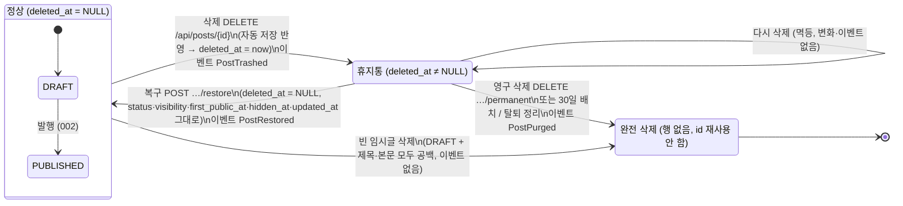

# Data Model: 내 글 관리와 글 삭제·휴지통

**Feature**: `006-manage-delete` | **Date**: 2026-10-07 | **Plan**: [plan.md](./plan.md)

**기준**: [docs/51-erd-unified.md](../../docs/51-erd-unified.md)(통합 ERD V1, 2026-10-07)을 따른다. 51 머리말과 "ERD 변경 제안"은 `erd/V1__common_schema.sql`을 원본으로 가리키지만, **이 파일은 저장소에 없다**(README "알려진 누락"). 그래서 51 본문의 컬럼표(§2)·제약·인덱스표(§3)·SQL 블록을 기준으로 삼았다. [docs/03-erd.md](../../docs/03-erd.md)는 설계 결정의 배경으로만 참고했다.

**스키마 변경**: **없음.** 이 기능은 V1에 이미 있는 컬럼·인덱스·FK만 쓴다(41 "ERD 변경 제안: 없음", 헌법 I). 51에 없는 것은 아래 §6에 "추가 제안"으로 따로 표시했다.

---

## 1. 이 기능이 쓰는 엔티티

### 1-1. `post` — 글 (post 모듈 소유, 읽기·쓰기)

| 컬럼 | 타입 | NULL | 이 기능에서의 쓰임 |
|---|---|---|---|
| `id` | bigint IDENTITY | 불가 | PK. 커서 2차 키. **완전 삭제 후 재사용 안 함**(IDENTITY라 자동 보장, FR-035) |
| `author_id` | bigint FK → member RESTRICT | 불가 | 모든 조회·잠금의 소유 조건 `= :me` |
| `title` | varchar(100) | 불가 (기본 `''`) | 목록 표시(비면 화면에서 "(제목 없음)"), 빈 임시글 판정 |
| `content_md` | text | 불가 (기본 `''`) | **빈 임시글 판정 때만** 잠금 쿼리에서 읽음. 목록 쿼리는 읽지 않음(FR-012) |
| `content_html` | text | 불가 | 읽지 않음 |
| `status` | varchar(20) | 불가 | `DRAFT` / `PUBLISHED` — 탭 구분. 삭제·복구로 바뀌지 않음 |
| `visibility` | varchar(20) | 불가 | `PUBLIC` / `PRIVATE` — 발행 글 필터·배지. 삭제·복구로 바뀌지 않음 |
| `view_count`·`like_count`·`comment_count` | bigint·int·int | 불가 | 발행 글 줄의 숫자(41 M-8). 휴지통에 있어도 보존 |
| `edit_version` | bigint | 불가 | 휴지통 이동 전 자동 저장 반영 때 "더 새 버전만" 조건 |
| `published_at` | timestamptz | 허용 | "발행 2026.10.01" |
| `first_public_at` | timestamptz | 허용 | 공개 목록 위치. **삭제·복구로 바뀌지 않음**(D-4) |
| `edited_at` | timestamptz | 허용 | "· 수정됨 10월 3일" |
| `updated_at` | timestamptz | 불가 | 임시글·발행 글 탭 정렬·커서. **삭제·복구로 바뀌지 않음**(research R3) |
| `deleted_at` | timestamptz | 허용 | **휴지통 표시.** NULL = 정상, 값 = 휴지통에 넣은 시각. 휴지통 정렬·커서·30일 판정 |
| `hidden_at` | timestamptz | 허용 | NOT NULL이면 "운영 정책에 따라 숨겨짐" 배지(FR-010). 삭제·복구로 바뀌지 않음(43 §4-1) |
| 그 밖의 컬럼 (`excerpt`, `thumbnail_url`, `render_version`, `created_at`, `hidden_by`, `hidden_reason`) | | | 이 기능에서 읽지도 쓰지도 않는다 |

**관련 제약 (51 §3, 변경 없음)**:

- `ck_post_status`, `ck_post_visibility`, `ck_post_published`, `ck_post_public_at`
- `deleted_at`에는 CHECK가 없다. 상태와 독립이어서 어떤 상태에서도 휴지통에 넣을 수 있다.

**쓰는 인덱스 (51 §3)**:

| 인덱스 | 정의 | 용도 |
|---|---|---|
| `ix_post_manage` | `(author_id, status, updated_at DESC) WHERE deleted_at IS NULL` | 임시글·발행 글 탭 목록, 개수 쿼리의 정상 글 갈래 |
| `ix_post_trash` | `(author_id, deleted_at DESC) WHERE deleted_at IS NOT NULL` | 휴지통 탭 목록, 개수 쿼리의 휴지통 갈래, 30일 정리 배치(부분 인덱스 전체 스캔, research R13) |
| `post_pkey` | `(id)` | 삭제·복구·영구 삭제의 `id = :postId AND author_id = :me FOR UPDATE` |
| `ix_post_feed`·`ix_post_blog` | `… WHERE status='PUBLISHED' AND visibility='PUBLIC' AND deleted_at IS NULL AND hidden_at IS NULL` | 이 기능은 쓰지 않는다. 다만 휴지통 글이 공개 목록에서 빠지는 근거다(SC-001) |

**JPA 매핑**:

- `Post` 엔티티에 `@SQLRestriction("deleted_at IS NULL")`을 붙인다. 기본 조회에서는 휴지통 글이 보이지 않는다.
- 휴지통 글을 다루는 조회·잠금·삭제는 `TrashPostRepository`의 네이티브 SQL만 쓴다(13 §2-6).

### 1-2. `post_draft` — 작업본 (post 모듈 소유, 읽기·반영)

| 컬럼 | 쓰임 |
|---|---|
| `post_id` PK·FK → post **CASCADE** | 목록의 `editing` = `post_draft` 행 존재 여부(LEFT JOIN). 완전 삭제 때 함께 지워진다 |
| `title`, `content_md`, `edit_version`, `updated_at` | 발행 글을 휴지통으로 옮기기 직전, Redis 자동 저장분을 반영하는 UPSERT 대상(04 §2-4 2-b). 휴지통에 있는 동안 보존된다(FR-022) |

### 1-3. 완전 삭제 때 함께 처리되는 테이블 (다른 모듈 소유 — 직접 쓰지 않음)

| 테이블 | FK (51 §3) | 완전 삭제 때 | 처리 주체 |
|---|---|---|---|
| `post_tag` | `post_id` → post **CASCADE**, `tag_id` → tag RESTRICT | 행 삭제. **`tag` 행은 남음**(FR-034) | DB CASCADE |
| `comment` | `post_id` → post **CASCADE**, `(post_id, parent_id)` → comment **CASCADE** | 남이 쓴 댓글·답글까지 삭제(D-5) | DB CASCADE |
| `post_like` | `post_id` → post **CASCADE** | 삭제 | DB CASCADE |
| `post_view_daily` | `post_id` → post **CASCADE** | 삭제 | DB CASCADE |
| `post_image` | `post_id` → post **CASCADE**, `image_id` → image CASCADE | 연결 행 삭제 | DB CASCADE (그 전에 media 단계가 `image.detached_at` 기록) |
| `image` | — | 그 글에서만 쓰던 사진에 `detached_at = now()` 기록. 행·파일은 003 정리 배치가 7일 뒤 지움 | media `ImagePostPurgeStep` (order 20) |
| `notification` | `post_id` → post **CASCADE**, `comment_id` → comment **CASCADE** | 그 글·그 글의 댓글을 가리키는 알림 삭제(25 NT-6) | DB CASCADE |
| `notification_actor` | `notification_id` → notification CASCADE | 위 알림과 함께 삭제 | DB CASCADE |
| `report_case` | `post_id` → post **SET NULL**, `comment_id` → comment **SET NULL** | ① DELETE 전에 `PENDING` → `CLOSED_NO_TARGET`, `handled_at = now()`, `handled_by = NULL` ② DELETE 때 대상 FK만 NULL. 행·스냅샷·`report`는 남음(FR-033) | 신고 모듈 `ReportPostPurgeStep` (order 10) + DB SET NULL |

**FK 확인**: 51 §3 기준으로 `post`와 `comment`를 가리키는 FK는 모두 CASCADE 또는 SET NULL이다. 그래서 정상 흐름에서는 `DELETE FROM post`가 RESTRICT에 막히지 않는다. 예상 밖으로 FK 위반이 나면 23001과 23503을 모두 FK 위반으로 처리한다(01 결정 기록 2026-10-06).

**`ck_report_case_target_ref` 확인**: SET NULL로 `post_id`·`comment_id`가 NULL이 되어도 CHECK를 통과한다(51 §3 설명 "대상이 지워져 NULL이 되어도 통과").

### 1-4. Redis (002 소유, 이 기능은 읽고 지우기만)

| 키 | 형식 | 이 기능에서 |
|---|---|---|
| `autosave:post:{postId}` | Hash(`memberId, title, contentMd, version, savedAt`), TTL 24h | 휴지통 이동 직전 읽어 DB 반영 → 커밋 후 "버전 ≤ 반영 버전"일 때만 삭제. 완전 삭제 커밋 후에도 삭제 |
| `autosave:dirty` | Set | 위와 함께 postId 제거 |

---

## 2. 읽기 모델 (API 응답, 테이블 아님)

### 2-1. 관리 목록 항목 `ManagePostItem`

41 §5의 응답 필드를 그대로 쓴다. 본문 필드는 없다.

| 필드 | 출처 | 비고 |
|---|---|---|
| `id` | `post.id` | |
| `title` | `post.title` | 빈 문자열 가능. 화면이 "(제목 없음)"으로 표시 |
| `status` | `post.status` | `DRAFT` / `PUBLISHED` — 휴지통 항목에서는 "원래 상태"(임시글이었음/발행 글이었음) |
| `visibility` | `post.visibility` | 임시글 탭 화면에서는 표시하지 않음(41 §3-1) |
| `editing` | `post_draft` 존재 | [수정 중] 배지 |
| `hidden` | `post.hidden_at IS NOT NULL` | 숨김 배지 |
| `updatedAt` | `post.updated_at` | "마지막 저장 …" |
| `publishedAt` | `post.published_at` | |
| `editedAt` | `post.edited_at` | |
| `deletedAt` | `post.deleted_at` | 휴지통 탭에서만 값 |
| `purgeAt` | `deleted_at + blog.post.trash.retention` | 휴지통 탭에서만 값. 계산값 |
| `viewCount`·`likeCount`·`commentCount` | `post.*_count` | |

### 2-2. 탭 개수 `ManageCounts`

`{ drafts, published, trash }`. 첫 요청(`cursor` 없음)에만 계산한다. 쿼리 한 문장에 `UNION ALL` 두 갈래를 쓴다(research R18). [더 보기] 응답에서는 생략(`null`)한다. 발행 글 개수는 숨긴 글을 포함하고 공개/비공개 필터와 무관하다.

### 2-3. 커서 `ManageCursor`

불투명 Base64URL(패딩 없음) JSON이다. 형식은 research R16에 있다.

- 임시글·발행 글: `k = [updated_at µs, id]`
- 휴지통: `k = [deleted_at µs, id]`

탭(`t`)과 필터(`f`)를 함께 담는다. 요청과 맞지 않으면 400 `INVALID_CURSOR`다.

---

## 3. 상태 전이

| 전이 | 사전 조건 (잠금 후 판정) | 변경 | 사후 조건 | 실패 |
|---|---|---|---|---|
| 휴지통으로 | 내 글, `deleted_at IS NULL`, 빈 임시글 아님 | 자동 저장 반영(있으면) → `deleted_at = now()` | 모든 공개 목록·상세에서 제외, 반응·작업본·태그·사진 연결 보존 | 남의 글·없는 글 404 |
| 빈 임시글 즉시 삭제 | 내 글, `status = DRAFT`, 반영 후 `btrim(title, E' \t\r\n') = '' AND btrim(content_md, E' \t\r\n') = ''`(002 `EmptyDraftPolicy`와 같은 문자 집합) | `PostPurgeService.purge` (이벤트 없음) | 행 없음 | 〃 |
| 다시 삭제 | 내 글, `deleted_at IS NOT NULL` | 없음 | `purgeAt` 그대로 | 〃 |
| 복구 | 내 글, `deleted_at IS NOT NULL` | `deleted_at = NULL` | 원래 탭·원래 위치. 숨김 유지 | 휴지통 아님·남의 글·없는 글 404 |
| 영구 삭제 | 내 글, `deleted_at IS NOT NULL` | `PostPurgeService.purge` | 행·연관 행 없음, 신고 사건 종료, 사진 정리 대상 | 〃 |
| 30일 정리 | `deleted_at < now() - retention` (잠금 후 다시 확인) | `PostPurgeService.purge` | 〃 | 실패한 글만 다음 날 재시도 |

**휴지통 글에 막히는 쓰기**: 자동 저장·수동 저장·발행·공개 범위 변경·변경 취소는 작성자라도 404다(FR-023, 42 §5-2). 각 API(002·004)의 소유 조회가 `deleted_at IS NULL`을 포함해야 한다. 엔티티 조회는 `@SQLRestriction`이 자동으로 걸러 준다. 네이티브 SQL은 06 §4처럼 조건을 직접 넣는다.

---

## 4. 검증 규칙 (FR → 데이터 수준)

| 규칙 | 근거 | 구현 위치 |
|---|---|---|
| 모든 조회·변경은 `author_id = :me`(세션). 요청에 사용자 값이 있어도 쓰지 않는다 | FR-002·FR-017, 헌법 III | `ManagePostQueryService`, `PostTrashService` |
| 목록에 본문 컬럼이 없다 | FR-012 | `ManagePostQueryRepository` 투영 |
| 페이지 크기는 서버 설정값(기본 20)이고 클라이언트 값은 무시한다 | FR-006, 헌법 VII | `blog.manage.page-size` |
| `tab ∈ {drafts, published, trash}`이며 기본 `drafts` | FR-003 | 컨트롤러 검증 → 400 `INVALID_TAB`(제안) |
| `visibility ∈ {public, private}`, `tab=published`에서만 적용 | FR-009 | → 400 `INVALID_VISIBILITY` |
| 빈 임시글 = `DRAFT` ∧ 공백 제거 후 제목·본문 모두 빈 문자열 | FR-020 | `Post.isEmptyDraft()` (002 정리 배치와 공용) |
| 휴지통 보관 기간은 설정값(기본 30일) | FR-030, 헌법 VII | `blog.post.trash.retention` |
| 한 글에 대한 동시 요청 직렬화 | FR-036 | `SELECT … FOR UPDATE` |

---

## 5. 설정값 (`application.yml`, 헌법 VII)

| 키 | 기본값 | 근거 |
|---|---|---|
| `blog.manage.page-size` | `20` | 41 M-6 |
| `blog.post.trash.retention` | `P30D` | 13 D-1 |
| `blog.post.trash.purge-cron` | `0 30 3 * * *` (Asia/Seoul) | 13 §2-5 "매일 새벽" — 시각은 제안 |
| `blog.post.trash.purge-batch-size` | `100` | 13 §2-5 |
| `blog.post.trash.purge-max-duration` | `PT30M` | 제안 (한 번 실행 상한) |

---

## 6. 51에 없는 것 (개인 확장/추가 제안)

| 항목 | 분류 | 내용 |
|---|---|---|
| `shedlock` 테이블 | **추가 제안 (팀 확인 필요)** | 배치 실행 잠금을 JDBC 방식으로 할 경우 필요하다. `name varchar(64) PK, lock_until timestamptz, locked_at timestamptz, locked_by varchar(255)`(ShedLock 표준). 공통 시작 템플릿(O9)의 Flyway 마이그레이션에 한 번만 추가하고, 002·003·014·015의 배치도 같이 쓴다. Redis 방식을 고르면 필요 없다(research R13) |
| `(deleted_at) WHERE deleted_at IS NOT NULL` 인덱스 | **추가 제안 (보류)** | 30일 배치가 실측에서 느릴 때만 올린다. 지금은 `ix_post_trash`로 충분하다고 본다 |

이 기능에는 개인 확장 컬럼이 없다. 검색·일괄 처리·작성자 통계는 범위 밖이다(41 M-10, spec Assumptions).
